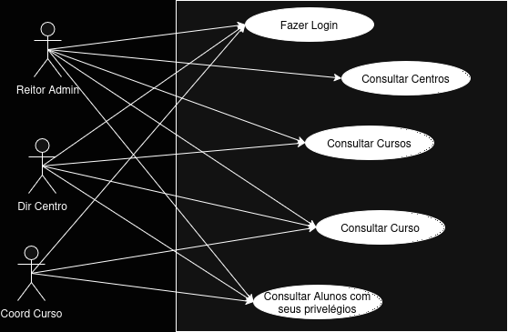
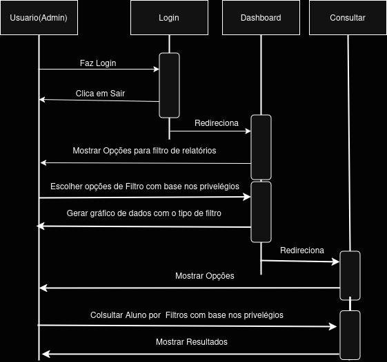

# Trabalho Final de Engenharia de Software I
# Evasômetro
____________
*Grupo* Jonas Silva, Bruno Munizz, Lucas Rosa

# Histórias do usuário (casos de uso)
____________________________

1. Os Usuários do Sistema serão: Reitor da Universidade, Diretores de Centro, e
Coordenadores de curso
   
2. Todos os usuários dejesam fazer o login e serem redirecionados para Uma página
que mostre os gráficos da taxa de evasão média com base no seu filtro escolhido
   
3. Os Usuários do sistema ainda querem consultar os alunos para poder ver sua matrícula,
nome, curso, centro e probabilidade de evasão, esta consulta é feita com base em filtros
para cada usuário com a sua visão do sistema mas para todos deve ter a opção de buscar
pela matrícula
   
4. O Reitor tem a visão de todos os centros, e cursos de cada centro, para cada centro
deve ser mostrado os cursos somente daquele centro
   
5. O Diretor de centro tem a visão de todos os cursos do seu centro, logo poderá consultar
os alunos de cada curso

7. O Coordenador do Curso tem a visão do seu Curso apenas

8. Com base no valor escolhido no filtro deve ser mostrado a taxa de evasão média de cada centro
quando todos forem selecionados e o mesmo vale para cursos

# Cronograma (planing poker)
## Desenvolvimento voltado para o Usuário Reitor admin
____________________________
1. protótipação de todas as páginas (usando Figma) (12h)
[autores: Bruno Munizz, Lucas Rosa, Yago]

2. desenvolvimento html e css da página de login (3h)
[autores: Bruno Munizz, Lucas Rosa, Yago]

3. desenvolvimento html e css de dashboard (reitor) (3h)
[autores: Bruno Munizz, Lucas Rosa, Yago]

4. desenvolvimento html e css de consultar aluno (coordenador) (3h)
[autores: Bruno Munizz, Lucas Rosa, Yago]

5. desenvolvimento html e css da home (index) (3h)
[autores: Bruno Munizz, Lucas Rosa, Yago]

6. implementação e construção dos gráficos dinâmicos, consultas e interações com Formulários
usando o chart.js e JS (16h)
[autores: Jonas Silva]

